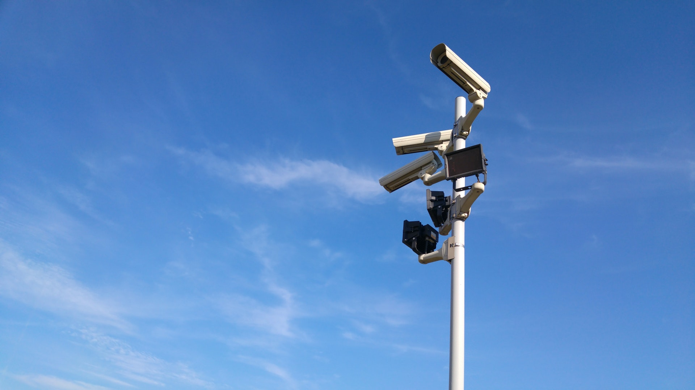
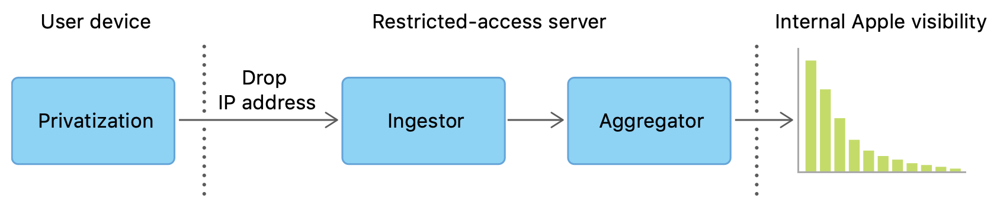
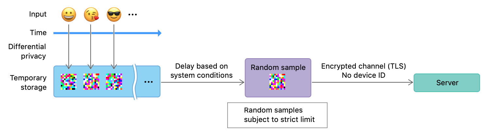
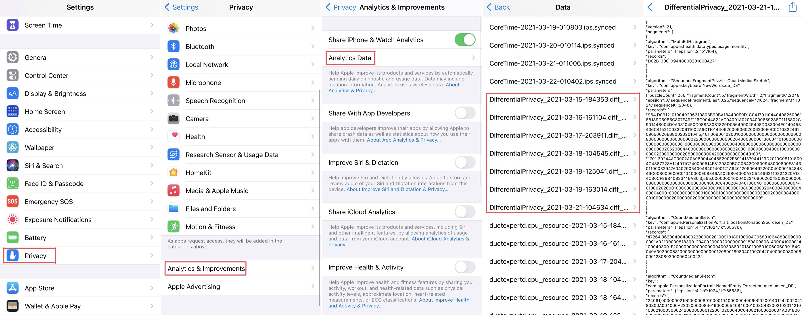

+++
title = "Differential Privacy in Praxis"
date = 2021-05-06T10:06:00Z
description = "An in-depth look on what Differential Privacy is and how it is implemented with an example from Apple and the U.S. Census."

aliases = ["differential-privacy-in-praxis"]

[taxonomies]
tags = ["Technology","Privacy"]
+++

> **Disclaimer**: This text originated from my final submission in the lecture "Data Warehouse" by [Andreas Buckenhofer](https://www.buckenhofer.com/about-me/). I have removed parts that specifically relate to the course.

In today's connected world data has become one of the most valuable goods. All kinds of services and devices are collecting data about users’ behavior to either improve their service to the user or to sell it to third parties. Many users dislike this data collection and want to have their data remain private and for it to only be used for, what they consider to be acceptable uses. Thus data is often anonymized such that patterns in the data can be analyzed without individual data points being able to be traced back to the individual.

Though as many methods of anonymization and pseudonymization are used, they can easily be made ineffective with access to other data sources, as can be seen in the example of the “Netflix Prize” in 2006. Netflix published a dataset with “micro-data” with movie rating information generated by their subscribers. They removed all identifying information and only published less than 1/10th of the entire dataset. Still, researchers at the University of Texas at Austin were able to correlate the data from the dataset with data from IMDB (Internet Movie Database) to gain knowledge about some of the users’ political orientation or sexual preferences[^1].

The term Differential privacy is generally attributed to Cynthia Dwork from the paper “Differential privacy” from 2006[^2].

Differential privacy is a mathematical definition of privacy that is used in the context of statistical and machine learning analysis. It allows for the collection of statistical estimates based on personal data without compromising the privacy of an individual[^3].

Differential privacy provides a criterion that can be implemented by many different privacy tools to protect data from a variety of privacy attacks, including re-linking and record linkage. It is also able to protect from attacks that are unknown at the time of application[^3].

This criterion provides a guarantee that the statistical results drawn from a differentially private dataset are statistically equivalent whether a single individual is part of the dataset or not. Thus the individuals’ information is protected as if their information was not used at all[^3].

Two cases of differential privacy are taken into account. A “central” case, where data is available in full on a central trusted server to which only a limited amount of people have access. The data is centrally privatized and given out for analysis from there. The second “local” case applies differential privacy at the source and thus no sensitive data is saved on any server in the first place[^3].

Differential privacy defines the so-called “privacy loss parameter”, which is commonly denominated by epsilon. The higher epsilon is, the more information can be gained about an individual by looking at the dataset. Privacy loss increases with the number of queries done against the dataset, but it is bounded by a known function of epsilon[^3].

Differential privacy has multiple benefits besides just protecting an individual’s privacy. Analysts don’t have to think about particular privacy attacks as they are covered by the guarantee discussed above. Privacy tools don’t have to be kept secret and the computations and parameters can be publicly shared, which creates certainty around the accuracy of the analysis using the data. Data summaries of data that was previously too sensitive to share, can be made public when using differential privacy[^3].

# Differential Privacy in Action

Differential privacy is in its early stages of adoption and thus examples are rare. Still, there are already some major companies using it in some of their biggest products. In this section, we will take a look at two examples from Apple, and the U.S. Census Bureau. We will look into the purpose for which each respective company uses differential privacy and we will look into their implementation of differential privacy and possible issues they had to solve.

## Apple - macOS & iOS Analytics

Apple is using differential privacy in some of its potentially privacy-sensitive analytics collected in the macOS and iOS operating systems.

In the article “Learning with Privacy at Scale”[^4] the Differential Privacy Team describes that they are using a local approach, where the data is privatized on-device immediately as the trigger-event happens. They then store that data on-device until once per day a limited amount of randomly selected events per use-case are transmitted to Apples’ restricted-access servers via TLS encryption and without any device identifiers. IP addresses are discarded and the data is separated into use-cases. At this point, different records can not be correlated anymore and are then used to calculate statistics and are shared internally with relevant teams[^4].

The reports are stored on-device and can be viewed by the user. For example, in iOS, they can be found in the privacy section of the settings, as can be seen below.

Apple has developed three algorithms for different use-cases to ensure differential privacy. CMS (Count Mean Sketch) can output a histogram of counts over a known domain of data and is used to discover popular emojis. HCMS (Hadamard Count Mean Sketch) is a modified CMS that reduces the required device bandwidth cost to a single privatized bit and is used to detect high energy and memory usage in Safari. SFP (Sequence Fragment Puzzle) works without knowing the domain of the data such as when discovering new words[^4].

According to “Learning with Privacy at Scale” these algorithms are used to gain insights in the following categories: “Discovering New Words”, “Discovering Popular Emojis”, “Safari Auto-play Intent”, “Identifying High Energy and Memory Usage in Safari” and “Understanding HealthKit Usage”. Sadly the paper doesn’t contain an explicit publishing date but due to the newest referenced sources being from 2016 and Apple releasing their first operating systems to use differential privacy (iOS 10 and macOS 10.12) in 2016, the paper is probably from around that time[^4].

After looking at some reports on an iOS device running iOS 14.5 it is apparent, that Apple has since increased the amount of analytics they collect using differential privacy. Some keys that can be found are “com.apple.safari.Translation.userMayWantTranslation.others_en”, which is likely used to improve the suggestion of automatic translation in Safari, or “com.apple.screentime.usagetracking.UnknownDomain”, which might be used to discover new categories to be tracked using the Screentime feature. Also, new algorithms seem to have been developed like “MultiBitHistogram”.

### Criticism

The researchers behind “Privacy Loss in Apple’s Implementation of Differential Privacy on MacOS 10.12” have done an investigation into the inner workings and the effectiveness of Apple’s differential privacy implementation and concluded that it has its shortcomings. These include that Apple tries to keep its algorithms secret, which is contrary to one of the core principles behind differential privacy. This makes it harder for users to evaluate the possible implications of opting into analytics collection. It also theoretically allows Apple to change its settings secretly and thus collect more data. Furthermore, the privacy budget that is used is per use-case and thus has to be summed together. It is also replenished every day, thus allowing for significantly larger amounts of data to be collected over many days[^5].

The researchers commend Apple for making a move in the direction of differential privacy but they call on them to make their algorithms public and have the parameters be user-tuneable[^5].

Frank McSherry, a co-inventor of differential privacy, has also criticized Apple for this but at the same time said that one shouldn’t judge them too much, as, after all, they are putting considerable effort into their users’ privacy. Not only with their use of differential privacy but also other technologies like full-disk and end-to-end encryption on their devices and services. He also states that some differential privacy is better than none at all[^6].

## U.S. Census Bureau - Analysis of Citizens

The U.S. Census Bureau is the federal government’s statistical agency of the United States. It is responsible for providing accurate information about the American people, places, and the economy. Therefore a census is conducted at the start of each decade as required by the U.S. Constitution[^7]. The collected data is then used by the government to, for example, distribute Congressional seats and to allocate funds[^8].

The collected data is required to be kept confidential by federal law. Publications may only contain statistical data or other data which is not able to be correlated back to an individual. Therefore the Bureau has been using different and ever-improving anonymization techniques since 1960. These, for example, include the removal of direct identifiers, the use of a minimum population threshold for each area, and data swapping[^9].

With the rise of Big Data analysis, it has become of concern that the data released by the Bureau might be able to be cross-referenced and thus deanonymized. Therefor in 2018 , the U.S. Census Bureau decided to use differential privacy for their newest 2020 census[^10]. Since then they have conducted a lot of research to figure out the differential privacy methods and parameters that are best suited for their data. The challenges that they have hit are documented publicly and provide a good general picture of the problems one might encounter when trying to apply differential privacy to their data.

### Challenges of Differential Privacy

The challenges encountered by the U.S. Census Bureau are complex and plentiful. They range from purely scientific issues over operational issues to issues encountered by the users of the data[^11]. In the following, I will provide some interesting and maybe unexpected examples for each area.

### Scientific Issues

Scientific issues arise because differential privacy itself is still a relatively new topic and one that has so far mostly found application in the computer science context with companies like Apple (found above). The U.S. Census Bureau, as a statistical agency, operates in a different realm[^11].

The Bureau has historically released certain counts unchanged, like the accurate count of people living in a block, while other more specific counts are privatized. The influence of these invariants, as they call them, on differential privacy is not yet fully known[^11].

A lot of different data has to be extracted from the same dataset. This creates the possibility to make one table more accurate at the cost of another. As different tables will be more or less relevant for different data users a question around how these trade-offs should be handled arises. The Bureau has found that there exists no well-defined theory on how to measure the relative impact of added noise to different data outputs[^11].

The privacy loss parameter epsilon has to be carefully set to allow for sufficiently accurate data, while at the same time providing sufficient protection to the individual. The Bureau decided that this important value should be set by policymakers. They created example graphs that displayed the privacy/accuracy tradeoff and the committee picked a value that was then tripled to allow for multiple releases. That value was significantly higher than what differential privacy creators seem to have implied to be reasonable: “much less than one”[^11].

### Operational Issues

Operational issues implementing differential privacy were also encountered. The U.S. Census Bureau had considerable issues finding experts that had experience with differential privacy, as the topic is barely covered in university lectures of the degrees that they are normally hiring from. They also found a lack of toolsets that would help them implement and verify their differential privacy algorithms. They compare this situation to the rise of Public Key Cryptography in 1989[^11].

The Bureau uses a central differential privacy approach, where they have the data in full on their servers and use differential privacy to release data tables to the public. Thus all of the differential privacy calculations, regarding the addition of noise, have to be done centrally. This requires an increased amount of computing resources by the factor of at least 3 in comparison to the 2010 census. To achieve this they are moving to use Amazon Web Services (AWS) to run their calculations[^11].

Differential privacy relies heavily on the usage of noise patterns. To generate noise that is suited for use in a production differential privacy system a Random Number Generator (RNG) is needed. As the Bureau will need an estimated amount of 90 TB of random data, high speed is also of concern. During their in-depth analysis of multiple RNGs, they found multiple software quality issues and implementation errors and settled on using an AES based user-level cryptographically secure pseudorandom number generator (CSPRNG) run 96 times on an r5.24xlarge AWS instance in combination with the output from the Linux kernel `/dev/urandom` device[^12].

### Data Users

Data users also had trouble understanding how to use the new differentially private data. The Bureau accredits this confusion to the increased amount of transparency. The previous DAS systems were undisclosed and thus data users didn’t feel like they had to care for it. They just assumed that the data they are using is correct. The notion of publicly disclosing the addition of noise into the data creates uncertainty for them. The Bureau thinks that this issue can be fixed by the creation of simpler educational material around differential privacy[^11].

### Conclusion

Finally, the Bureau has made the recommendation to increase communication around differential privacy with a controlled vocabulary to achieve awareness of its benefits and reduce uncertainty in public discussions[^11].

The U.S. Census Bureau has published even more resources around the challenges of implementing differential privacy and this summary only includes a selection of issues. If you are interested in further resources, please take a look at “Issues Encountered Deploying Differential Privacy”[^11] and “Randomness Concerns when Deploying Differential Privacy”[^12] in detail, as well as “Implementing Differential Privacy: Seven Lessons From the 2020 United States Census”[^13].

[^1]: A. Narayanan and V. Shmatikov, “How To Break Anonymity of the Netflix Prize Dataset,” arXiv:cs/0610105, Feb. 2008, Accessed: Mar. 21, 2021. [Online]. Available: [http://arxiv.org/abs/cs/0610105](http://arxiv.org/abs/cs/0610105)

[^2]: C. Dwork, “Differential privacy,” in 33rd international colloquium on automata, languages and programming, part II (ICALP 2006), Jul. 2006, 33rd International Colloquium on Automata, Languages and Programming, part II (ICALP 2006)., vol. 4052, pp. 1–12, [Online]. Available: [https://www.microsoft.com/en-us/research/publication/differential-privacy/](https://www.microsoft.com/en-us/research/publication/differential-privacy/).

[^3]: A. Wood et al., “Differential Privacy: A Primer for a Non-Technical Audience,” Vanderbilt Journal of Entertainment &amp; Technology Law, 2018, Accessed: Mar. 21, 2021. [Online]. Available: [https://dash.harvard.edu/handle/1/38323292](https://dash.harvard.edu/handle/1/38323292).

[^4]: Differential Privacy Team, Apple, “Learning with Privacy at Scale,” p. 25.

[^5]: J. Tang, A. Korolova, X. Bai, X. Wang, and X. Wang, “Privacy Loss in Apple’s Implementation of Differential Privacy on MacOS 10.12,” arXiv:1709.02753 [cs], Sep. 2017, Accessed: Mar. 21, 2021. [Online]. Available: [http://arxiv.org/abs/1709.02753](http://arxiv.org/abs/1709.02753).

[^6]: A. Greenberg, “How One of Apple’s Key Privacy Safeguards Falls Short,” Wired, Sep. 15, 2017.

[^7]: “U.S. Census Bureau at a Glance,” p. 2, Oct. 2018, [Online]. Available: [https://www2.census.gov/about/census-at-a-glance.pdf](https://www2.census.gov/about/census-at-a-glance.pdf).

[^8]: “What We Do,” The United States Census Bureau. [https://www.census.gov/about/what.html](https://www.census.gov/about/what.html) (accessed Apr. 16, 2021).

[^9]: L. McKenna, “Research and Methodology Directorate,” p. 15, Apr. 2019, [Online]. Available: [https://www2.census.gov/adrm/CED/Papers/FY20/2019-04-McKenna-Six Decennial Censuses.pdf](https://www2.census.gov/adrm/CED/Papers/FY20/2019-04-McKenna-Six Decennial Censuses.pdf).

[^10]: “Differential Privacy for Census Data Explained.” [https://www.ncsl.org/research/redistricting/differential-privacy-for-census-data-explained.aspx](https://www.ncsl.org/research/redistricting/differential-privacy-for-census-data-explained.aspx) (accessed Apr. 13, 2021).

[^11]: S. L. Garfinkel, J. M. Abowd, and S. Powazek, “Issues Encountered Deploying Differential Privacy,” Proceedings of the 2018 Workshop on Privacy in the Electronic Society, pp. 133–137, Jan. 2018, doi: 10.1145/3267323.3268949.

[^12]: S. L. Garfinkel and P. Leclerc, “Randomness Concerns when Deploying Differential Privacy,” in Proceedings of the 19th Workshop on Privacy in the Electronic Society, Virtual Event USA, Nov. 2020, pp. 73–86, doi: 10.1145/3411497.3420211.

[^13]: “Implementing Differential Privacy: Seven Lessons From the 2020 United States Census,” Harvard Data Science Review, Apr. 2020, doi: 10.1162/99608f92.353c6f99.
