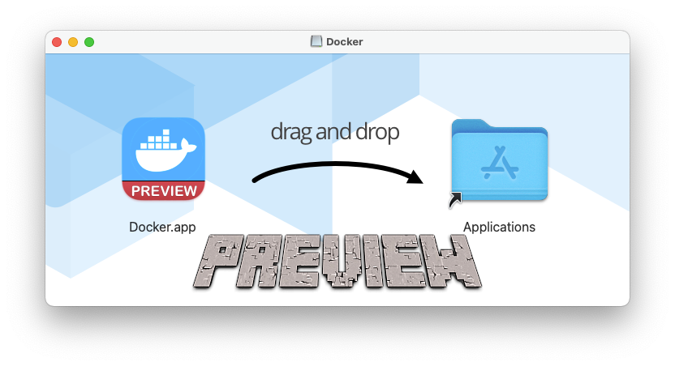
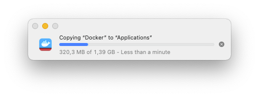
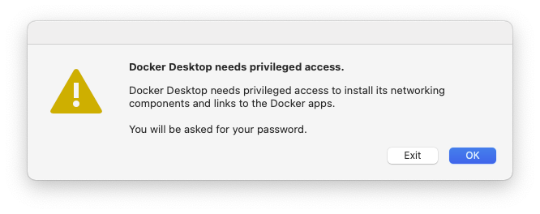
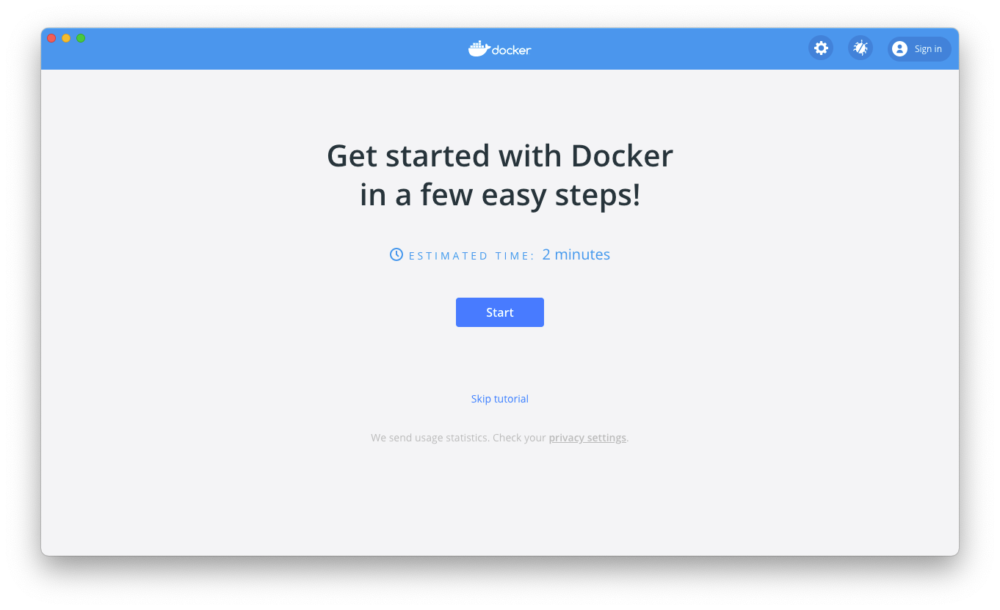
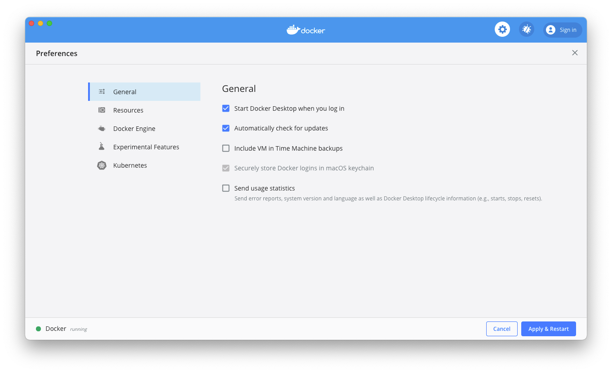
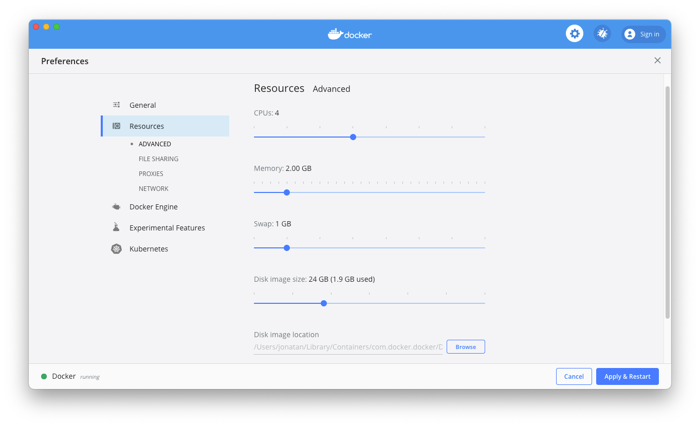
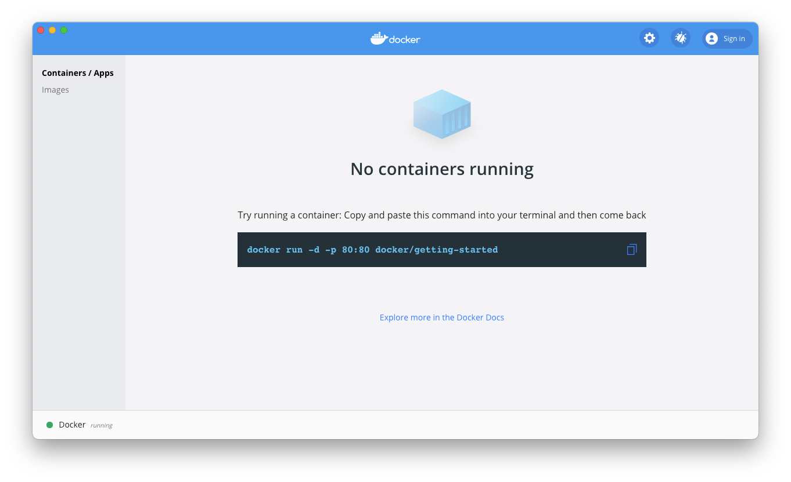
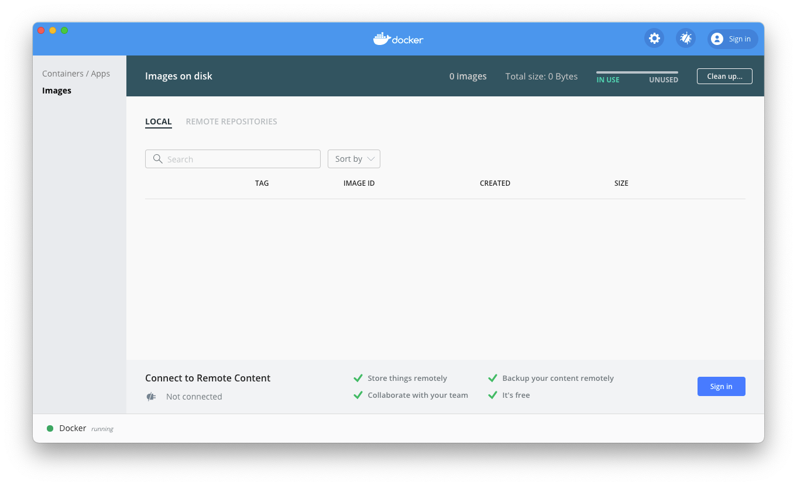
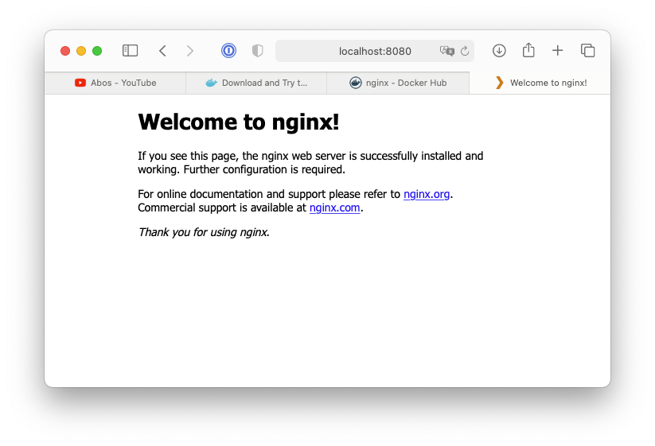

+++
title = "Initial Impressions of the Docker Preview for Apple Silicon"
date = 2021-01-04T15:43:00Z
description = "My initial impressions of using the Docker Preview for Apple Silicon."

aliases = ["initial-impressions-of-the-docker-preview-for-apple-silicon"]

[taxonomies]
tags = ["Technology","Apple Silicon"]
+++

I just found out that Docker has released a first Preview of Docker on Apple Silicon. It's been there for a while, but I just found out and I am really excited, as I use Docker a lot for development purposes. Pulling a container is just often times a lot simpler, then having to install a particular suite of software components.

In this post, I want to share my initial impressions of using the Docker Preview with potential problems or other quirks that I will encounter.
So stick along for the ride.

## Installation and Setup

I downloaded the Docker Preview from the [Docker blog post](https://www.docker.com/blog/download-and-try-the-tech-preview-of-docker-desktop-for-m1/) and installed it as usual.





Docker asked for privileged access to install its networking components, which makes sense.



The window disappeared and I though docker had stopped, but after a good few seconds a getting started guide tutorial appeared.



I jumped right into the link to the privacy settings as I like to turn a lot of that stuff off and landed right in the settings which I dug through.

From what I saw online these are mostly the same as the normal Docker Desktop installation but this is my first time using anything from Docker that is not in the command line, thus I checked everything out and tweaked a few things to my liking.





At this point I went back, skipped the tutorial and was greeted by what appears to be the main screen:





As everything appears to be ready, I jumped into a terminal and started testing around.

## Trying to run basic containers

I started up an Nginx container and everything seemed to work like normal.

```bash
jonatan@Jonatans-Mini ~ % docker run -d -p 8080:80 nginx
Unable to find image 'nginx:latest' locally
latest: Pulling from library/nginx
c9648d7fcbb6: Pull complete 
af2653e2da79: Pull complete 
1af64ee707c7: Pull complete 
3bdc08a2d3ea: Pull complete 
fed23bd0d00d: Pull complete 
Digest: sha256:4cf620a5c81390ee209398ecc18e5fb9dd0f5155cd82adcbae532fec94006fb9
Status: Downloaded newer image for nginx:latest
fc1afa21085cd89f4005a50465e597847f855a8ea508ce2fb3c15b164a29e710

jonatan@Jonatans-Mini ~ % docker ps
CONTAINER ID   IMAGE     COMMAND                  CREATED         STATUS         PORTS                  NAMES
fc1afa21085c   nginx     \"/docker-entrypoint.…\"   9 seconds ago   Up 7 seconds   0.0.0.0:8080->80/tcp   nifty_noether

jonatan@Jonatans-Mini ~ % docker logs nifty_noether
/docker-entrypoint.sh: /docker-entrypoint.d/ is not empty, will attempt to perform configuration
/docker-entrypoint.sh: Looking for shell scripts in /docker-entrypoint.d/
/docker-entrypoint.sh: Launching /docker-entrypoint.d/10-listen-on-ipv6-by-default.sh
10-listen-on-ipv6-by-default.sh: info: Getting the checksum of /etc/nginx/conf.d/default.conf
10-listen-on-ipv6-by-default.sh: info: Enabled listen on IPv6 in /etc/nginx/conf.d/default.conf
/docker-entrypoint.sh: Launching /docker-entrypoint.d/20-envsubst-on-templates.sh
/docker-entrypoint.sh: Configuration complete; ready for start up
172.17.0.1 - - [04/Jan/2021:13:54:55 +0000] \"GET / HTTP/1.1\" 200 612 \"-\" \"Mozilla/5.0 (Macintosh; Intel Mac OS X 10_15_6) AppleWebKit/605.1.15 (KHTML, like Gecko) Version/14.0.2 Safari/605.1.15\" \"-\"
172.17.0.1 - - [04/Jan/2021:13:54:55 +0000] \"GET /favicon.ico HTTP/1.1\" 404 153 \"http://localhost:8080/\" \"Mozilla/5.0 (Macintosh; Intel Mac OS X 10_15_6) AppleWebKit/605.1.15 (KHTML, like Gecko) Version/14.0.2 Safari/605.1.15\" \"-\"
2021/01/04 13:54:55 [error] 29#29: *4 open() \"/usr/share/nginx/html/favicon.ico\" failed (2: No such file or directory), client: 172.17.0.1, server: localhost, request: \"GET /favicon.ico HTTP/1.1\", host: \"localhost:8080\", referrer: \"http://localhost:8080/\"
```



I mean, what was I expecting, right? It's a preview, but basic features like pulling and using a normal container should work fine.

But now I was curious. Nginx is a container that is available for pretty much every platform, including ARM and ARM 64. What happens if I try starting an x86-64 container?

As expected: Doesn't work, as it can't find an ARM repository for the requested image.

```bash
jonatan@Jonatans-Mini ~ % docker pull tensorflow 
Using default tag: latest
Error response from daemon: pull access denied for tensorflow, repository does not exist or may require 'docker login': denied: requested access to the resource is denied
```

## Trying docker-compose and building containers

Now let's try using docker-compose and building a Container. I opened up a simple NodeJS project, let it build and it worked fine.

```bash
jonatan@Jonatans-Mini shlinkbot % docker-compose up  
Creating network \"shlinkbot_default\" with the default driver
Building shlinkbot
Step 1/6 : FROM node:14-alpine
14-alpine: Pulling from library/node
20d8a246443a: Pull complete
396934c24989: Pull complete
c786943c5d28: Pull complete
da7b674bc60e: Pull complete
Digest: sha256:b2da3316acdc2bec442190a1fe10dc094e7ba4121d029cb32075ff59bb27390a
Status: Downloaded newer image for node:14-alpine
 ---> 66ba137c0d00
Step 2/6 : WORKDIR /app
 ---> Running in 530e4f1e50e5
Removing intermediate container 530e4f1e50e5
 ---> fd0a3fa000f2
Step 3/6 : COPY package*.json /app/
 ---> dc06af04f260
Step 4/6 : RUN npm ci --only=production
 ---> Running in 07f1900c77ed
added 9 packages in 0.49s
Removing intermediate container 07f1900c77ed
 ---> 6394ffc8cef5
Step 5/6 : COPY . /app/
 ---> 19fd5a171c5a
Step 6/6 : CMD [ \"node\", \"index.js\" ]
 ---> Running in 08de729cf708
Removing intermediate container 08de729cf708
 ---> 04631430bf86

Successfully built 04631430bf86
Successfully tagged shlinkbot_shlinkbot:latest
WARNING: Image for service shlinkbot was built because it did not already exist. To rebuild this image you must use `docker-compose build` or `docker-compose up --build`.
Creating shlinkbot_shlinkbot_1 ... done
```

I consider that a success.

## Conclusion

I am very excited about the first Preview of Docker for Apple Silicon to have become available, and I will use and test it out further in the coming weeks.
Seeing how well it works already, I am very optimistic that it will not take too long for it to become available as a final version.
Of course, there are probably still a lot of little quirks that they will have to work out, but getting it to function at all at this level that I see here is already a huge step in the right direction.
