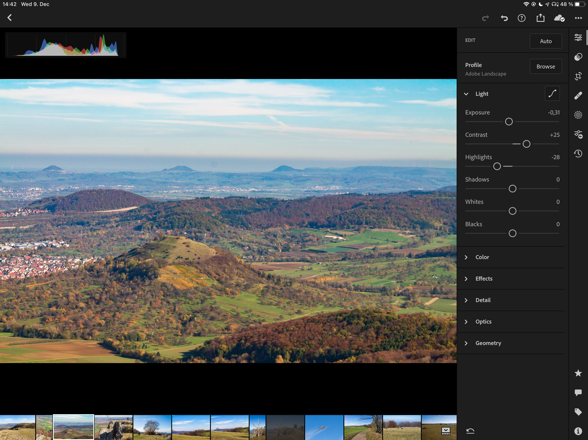
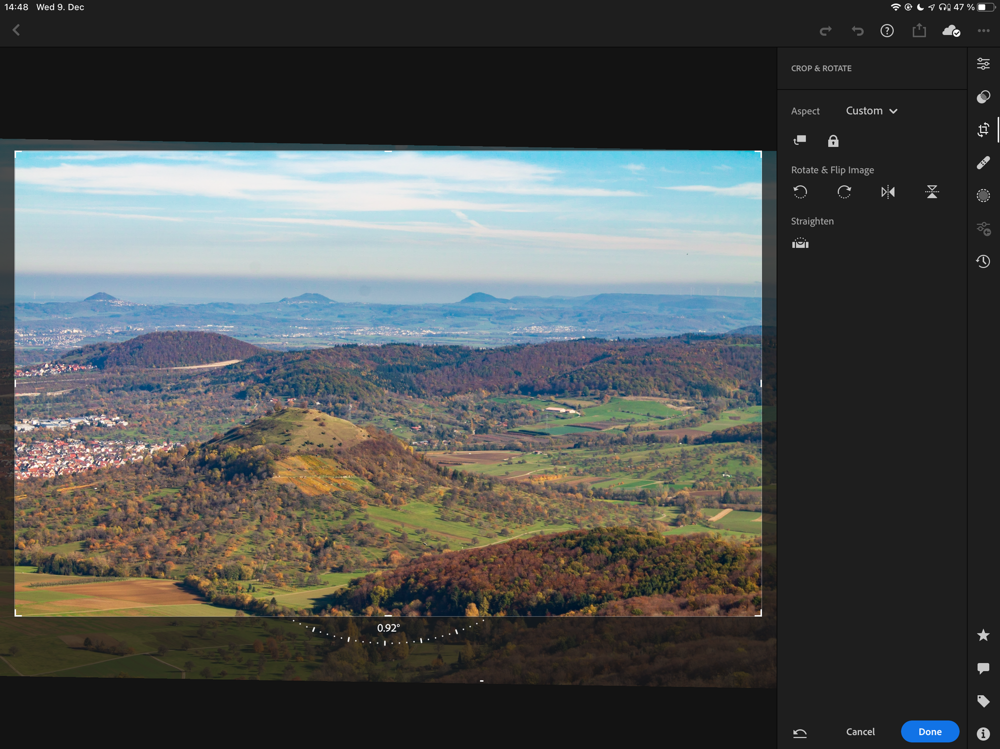
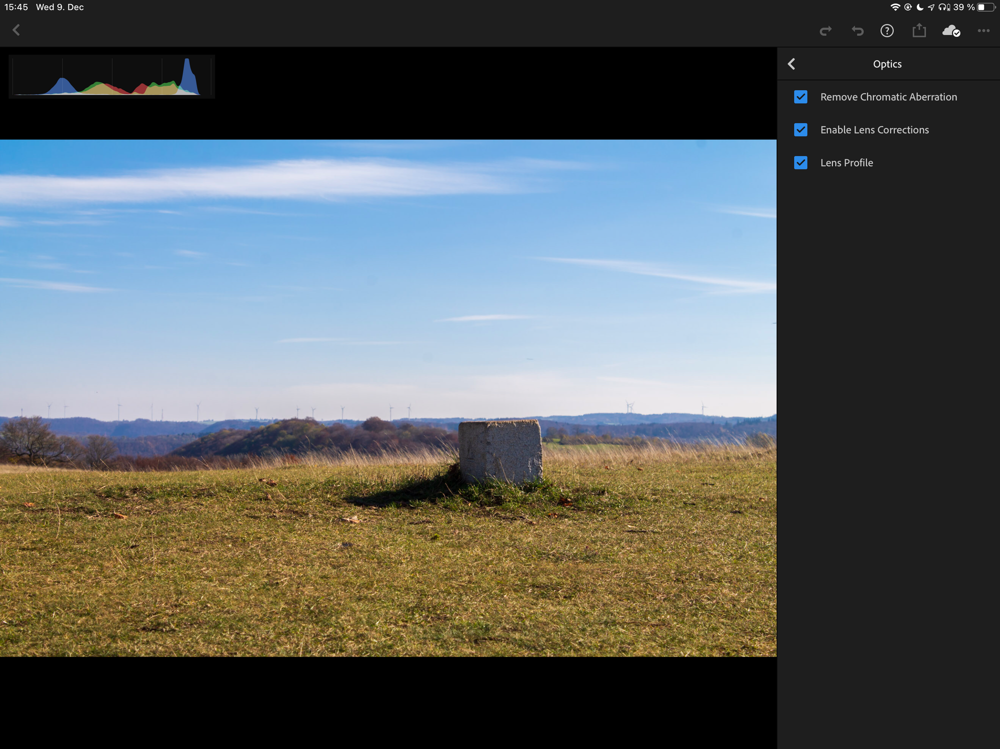

+++
title = "Trying RAW photo editing on iOS with Lightroom"
date = 2020-12-09T16:09:00Z

aliases = ["trying-raw-photo-editing-on-ios-with-lightroom"]

[taxonomies]
tags = ["Technology","Photography"]
+++

I got back into regularly photographing with my DSLR in the last couple of months and was struggling to find a good photo editing software for RAW photos.
I was previously using Photoshop on the desktop, but as I had moved to using Linux primarily I didn't want to keep booting into Windows to edit photos.
I tried digiKam, Darktable and RawTherapee and none of them really worked for me, so I decided to try and edit the photos on my iPad.

## The problem with the iOS photo library

I tried a few apps and liked multiple of them, but many of them I had to quickly rule out as the integrate with the iOS photo library.
The problem with the iOS photo library is that whenever I import images into it, it changes their names to whatever iOS sees fit. This resulted in an `IMG_8745.CR2` for example becoming an `IMG_2395.CR2`.
Keeping the original name is important to me, because I currently keep the original names of the images as set by the camera. I then want to have the edited image to have the same name, just with the .JPG ending, so that I can find the original RAW file easily, when I need to.
I really don't like this behavior of the iOS photo library and thus all apps that rely on it are automatically out.

## Entering Lightroom

[{{ resize_image(path="/content/posts/trying-raw-photo-editing-on-ios-with-lightroom/lightroom.png", width=200, height=200, op="fit") }}](https://apps.apple.com/us/app/adobe-lightroom-for-ipad/id804177739?itscg=30200&amp;itsct=apps_box)

Lightroom is different though. Adobe decided to have Lightroom maintain its own photo library and they have luckily also decided to not mess with the names of the images.

### Import

Lightroom can directly import images from an SD card that is connected to the device using an adapter or using the Files app.
I use the second route, as I also want to upload the RAW images to my server.

I thus first plug my SD card into my iPad and open the Files app. I then copy the images from the SD card into the [Documents](https://apps.apple.com/us/app/pixelmator-photo/id1444636541?itsct=apps_box&amp;itscg=30200) app by Readdle.

I use Documents for uploading the images, as its SMB and WebDAV implementations have been far more reliable for me, compared to the native Files app.

Documents also allows me to quickly cull the images. I go through the the images and can quickly delete the ones that are shaky or just simply don't spark any excitement in me.

I then go into Lightroom and import the images through the Files app.

### Editing

Everybody who has seen Lightroom on the desktop should be familiar with the interface on the iPad, as it is mostly the same.

Lightroom offers a lot of the sliders one comes to expect from a RAW editing application. Sure, apps like Darktable have a lot more dials to turn and things to tweak than Lightroom has on iOS, but for my needs it's perfect. And with the recent update Adobe even added support for color grading images with different dials for the Shadows, Midtones and Highlights.

The interface is easy to use and feels great to use with an Apple Pencil. The changes that one does reflect very quickly on the image, even though Lightroom uses a little trick here and only shows a downscaled version of the images as long as one drags a slider. It then quickly applies the change to the full image, once one releases the slider.

I would prefer to see my changes immediately on the full size image, but I think this is a fine compromise to save processing power and still give the user adequate feedback about the changes they are applying.

But not everything is perfect and there is one feature in particular that I am missing.
I started using Lightroom as well on the desktop under macOS and I found out that it is possible to configure the lens that was used, to apply the correct lens correction.

On iOS there is only an option to turn lens correction On or Off. Sadly though my camera doesn't seem to properly save the information about my kit lens in the image and thus this is not sufficient.

Luckily there is a little workaround one can use, if one has access to a desktop with Lightroom installed.
Lightroom allows the user to copy settings from one picture to another. Interestingly on iOS there is the option to not only copy \"Enable Lens Correction\" but also to copy the \"Lens Profile\". Thus one can properly configure the lens on one picture on the desktop, have the settings sync to the iPad via the Adobe Cloud and then copy and paste the correct profile to other / new pictures.

### Exporting

Exporting is also easy. One simply selects all of the images that they want to export and hit export. You can configure your desired export quality settings and even change the naming of the files (if you so desire). The you select a path to save the files and let Lightroom render.

I export my files back into Documents to also upload them to my server and at that point: I am done.

## Noteworthy mentions

One of the most popular ones is Darkroom:

[{{ resize_image(path="/content/posts/trying-raw-photo-editing-on-ios-with-lightroom/darkroom.png", width=200, height=200, op="fit") }}](https://apps.apple.com/us/app/darkroom-photo-video-editor/id953286746?itscg=30200&amp;itsct=apps_box)

I tried Darkroom and liked the clean interface and the speed. If you are fine with using the iOS photo library as an intermediary or as the primary organization method, Darkroom is a very good choice!

[{{ resize_image(path="/content/posts/trying-raw-photo-editing-on-ios-with-lightroom/photomator.png", width=200, height=200, op="fit") }}](https://apps.apple.com/us/app/pixelmator-photo/id1444636541?itscg=30200&amp;itsct=apps_box)

I have heard a lot of good things about Pixelmator Pro and it's ML features that automatically apply optimizations to an image. I haven't tried it yet myself, as I know I currently can't use it as my main app, as it also relies on the iOS photo library. But if I ever change my workflow, I'll make sure to check it out.
