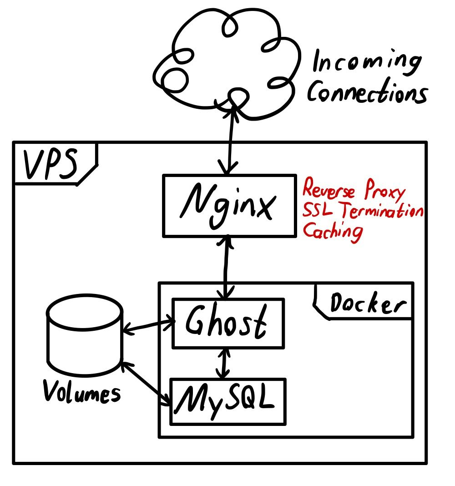

+++
title = "Why and How I setup my blog with Ghost"
date = 2020-11-11T06:46:00Z
description = "OUTDATED: A description of how I setup my old blog using Ghost"

aliases = ["why-and-how-i-setup-my-blog-with-ghost"]

[taxonomies]
tags = ["Technology"]
+++

Creating this website has been a very long process for me.
I had tried many different kinds of software that each had their own advantages and disadvantages.
In this post I want to explain to you the different phases I went through and how I landed on my current Ghost setup.

## Requirements

The first mistake I made was not having clearly made up my mind about what was important for me to have on my personal website.
This made it hard to judge different software, as I had no clear rating framework to compare them.
Thus I recommend to you, that if you are thinking about creating your own website or blog, to ask yourself some questions around what it should achieve for you.

Example questions could be:

- What kind of content do you want to put on your website?
- Do you want to write blog articles?
- Do you want to use the site as your personal resume?
- Do you want to primarily post pictures or text based content?
- Do you want to selfhost the site, or have a hosting provider?
- Do you want to have a visual interface for managing your site, or do you want something text based?
- How extensible and customizable do you want your site to be?

For me, it now looks something like this:

- I want to post blog articles on my site, sometimes including a good amount of images
- I want to selfhost my website on my VPS, preferably with Docker
- I considered more text based static website generators, but found out that I prefer a simple visual interface
- I want to be able to extend my website using some sort of API

## Failures

### Wordpress

My first attempt used Wordpress, as I knew that it is a very popular option for personal websites that does blogging very well and can be extended with a lot of plugins.
But after installing it, I was very overwhelmed by all of the options and thus seriously procrastinated setting it up.
The menus felt bloated with a lot of options that felt unnecessary but at the same time, it seemed like I had to install a multitude of plugins, to get all of the functionality I wanted.

Wordpress Pros:

- A lot of available themes and plugins
- A huge community
- Many hosting providers offer Wordpress as a One
- Click Install

Wordpress Cons:

- Feels very heavy and somewhat slow

### Hugo

I then thought about using a static website generator.
They mostly take simple Markdown files and convert them to Html files, that can then be directly served by your a webserver (Nginx in my case).
I had previously had bad experiences with [Jekyll](https://jekyllrb.com/), so I tried out [Hugo](https://gohugo.io/).
I really loved the simplicity of having everything as a file and being able to version control my entire site content with Git.
I looked at a lot of different themes that I could find on the Hugo website or on Github, but I didn't find anything that I really liked.
This put me in a position where I had to either customize an existing theme to my liking or create a new one.
As I am terrible at making a website look good with HTML and CSS, customizing was my only real option.
I looked into the documentation and got pretty overwhelmed with all of the different options one has to apply stylings to the site.
I tried a lot of things but never really liked anything that I could come up with, thus I scratched the idea of using a static website generator.

Hugo Pros:

- Fast page loading speed, due to static files
- Writing posts in Markdown
- Version control of the entire site with Git

Hugo Cons:

- I didn't find a good theme
- I was overwhelmed by theming options

## Why Ghost

I then discovered [Ghost](https://ghost.org/) through watching the YouTuber [Ali Abdaal](https://aliabdaal.com/), customize his Ghost site in a livestream.
I looked at the website and gave it a quick shot by running the Docker container.
My initial impression was good: The interface looked clean and even the default theme looked nice. Also: It offers easy integrations with different services and has an [API](https://ghost.org/docs/api/v3/).
I installed all of the free themes on the Ghost website and after a lot of testing landed on the [liebling](https://github.com/eddiesigner/liebling) theme.
The only thing I didn't like about it was that the initial page was immediately filled with blog articles, but I wanted to primarily have a little greeting text / about me on the main page.
Thus I cloned the Github repo and tried changing it.
After a few hours I was able to wrap my head around the how Ghost themes work and I copy and pasted some code to create what I wanted.
I also setup a Github Action to automatically deploy changes I make to the master branch of the theme on Github to my website, exactly as described [here](https://github.com/marketplace/actions/deploy-ghost-theme).

**Note**: If you change the routes.yml file and want to apply it, you have to manually upload it on the Ghost interface. It does not automatically get applied through the theme zip. This issue stalled me for about an hour.
You can find my customized version of the liebling theme [here](https://github.com/J0n4t4n/liebling).

### How to install Ghost with Docker

My setup looks like this:



I place all of my Docker applications in a subfolder of `/opt`, in this case `/opt/ghost`.
I have made some small adjustments to the default docker-compose.yml that I found online.
The main changes include changing two of the privacy settings to disable Gravatar and the update checker and including a mysql database that stores it's content in `/opt/ghost/db`.

**Note**: MySQL has to be version 5.7. Even though on the [Ghost Install page](https://ghost.org/docs/install/ubuntu/?_ga=2.101407559.739328239.1604995566-1472116781.1603178194#prerequisites) it states that version 8 can be used, the Docker container refused to work with it.

**Update: This is no longer true. Ghost now requires MySQL version 8 and will throw errors on version 5.7!**

My Nginx reverse proxy does SSL termination with a Let's Encrypt certificate and caches the page content.
This reduced loading times by a factor of 2 to 3.
Below you can find my `docker-compose.yml` and nginx configuration file content.

```docker-compose
version: '3.1'

services:

  ghost:
    image: ghost:3-alpine
    restart: always
    ports:
      - 2368:2368
    environment:
      # see https://docs.ghost.org/docs/config#section-running-ghost-with-config-env-variables
      NODE_ENV: production
      database__client: mysql
      database__connection__host: db
      database__connection__user: root
      database__connection__password: INSERT_SECRET_PASSWORD
      database__connection__database: ghost
      url: https://jsteuernagel.de
      server__host: '0.0.0.0'
      server__port: 2368
      privacy__useUpdateCheck: 'false'
      privacy__useGravatar: 'false'
    volumes:
      - ./content:/var/lib/ghost/content

  db:
    image: mysql:5.7
    restart: always
    environment:
      MYSQL_ROOT_PASSWORD: INSERT_SECRET_PASSWORD (same as above)
    volumes:
      - ./db:/var/lib/mysql
```

```nginx
proxy_cache_path /tmp/nginx_ghost levels=1:2 keys_zone=ghostcache:600m max_size=100m inactive=24h;

server {
    server_name jsteuernagel.de www.jsteuernagel.de;

    # Allow uploads up to 10M, otherwise issues with large image uploads can arise
    client_max_body_size 10M;

    proxy_set_header Host $host;
    proxy_set_header X-Real-IP $remote_addr;
    proxy_set_header X-Forwarded-For $proxy_add_x_forwarded_for;
    proxy_set_header X-Forwarded-Proto $scheme;
    proxy_set_header Upgrade $http_upgrade;
    proxy_set_header Connection upgrade;
    proxy_set_header Accept-Encoding gzip;

    location / {
        proxy_pass http://localhost:2368/;

        # Remove cookies which are useless for anonymous visitors and prevent caching
        proxy_ignore_headers Set-Cookie Cache-Control;
        proxy_hide_header Set-Cookie;
        # Add header for cache status (miss or hit)
        add_header X-Cache-Status $upstream_cache_status;

        # Allow gzip compression
        gzip on;
        gzip_disable \"msie6\";

        gzip_vary on;
        gzip_proxied any;
        gzip_comp_level 6;
        gzip_buffers 16 8k;
        gzip_http_version 1.1;
        gzip_min_length 256;
        gzip_types text/plain text/css application/json application/x-javascript text/xml application/xml application/xml+rss text/javascript application/vnd.ms-fontobject application/x-font-ttf font/opentype image/svg+xml image/x-icon;

        proxy_cache ghostcache;
        proxy_cache_valid 1h;
        # Don't cache 404 error pages as long, to allow for a fix to apply sooner
        proxy_cache_valid 404 5m;
        proxy_cache_bypass $http_cache_control;
        # Use conditional GET requests to refresh the content from origin servers
        # Allows a website refresh to request the newest content
        proxy_cache_revalidate on;
        proxy_buffering on;
        # Allows starting a background subrequest to update an expired cache item,
        # while a stale cached response is returned to the client.
        proxy_cache_background_update on;
        # Bypass cache for errors
        proxy_cache_use_stale error timeout invalid_header updating http_500 http_502 http_503 http_504;
    }

    location ^~ /ghost/ {
    # Don't cache anything on the admin interface, as this will cause issues
        proxy_pass http://localhost:2368/ghost/;
    }

    listen [::]:443 ssl http2; # managed by Certbot
    listen 443 ssl http2; # managed by Certbot
    ssl_certificate /etc/letsencrypt/live/jsteuernagel.de/fullchain.pem; # managed by Certbot
    ssl_certificate_key /etc/letsencrypt/live/jsteuernagel.de/privkey.pem; # managed by Certbot
    include /etc/letsencrypt/options-ssl-nginx.conf; # managed by Certbot
    ssl_dhparam /etc/letsencrypt/ssl-dhparams.pem; # managed by Certbot
}

server {
    listen 80;
    listen [::]:80;
    server_name jsteuernagel.de www.jsteuernagel.de;
    return 301 https://$server_name$request_uri;
}
```